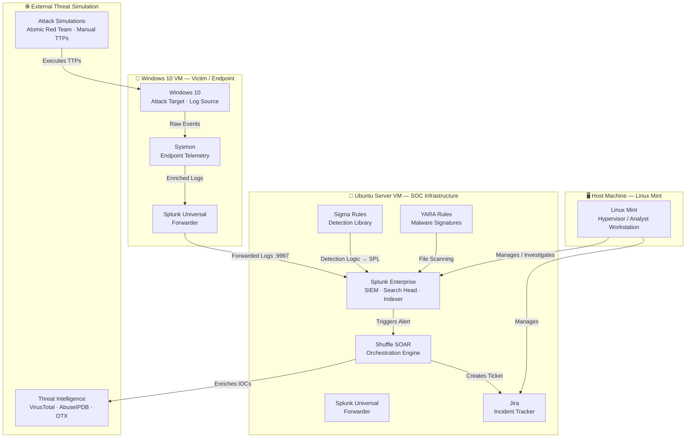
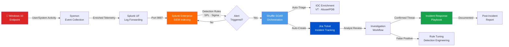
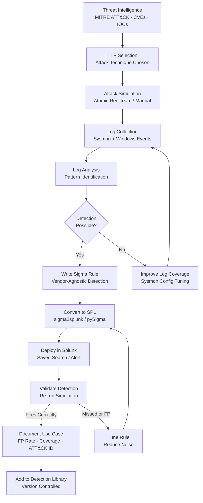
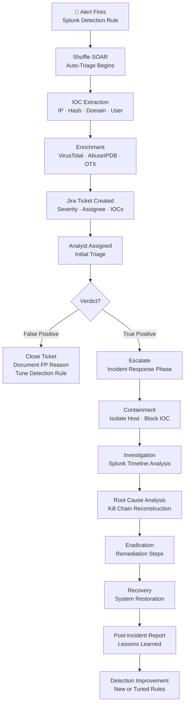
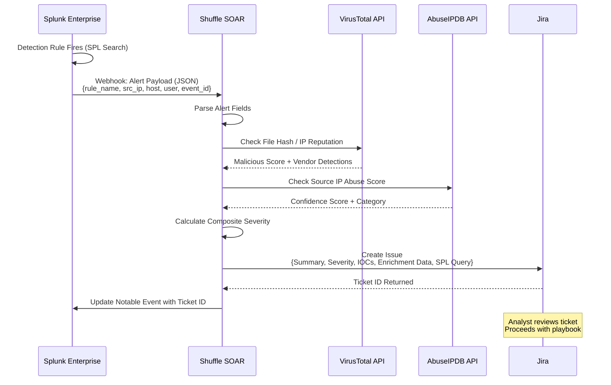

<div align="center">

<!-- HERO BANNER -->
<!-- Recommended: Create a banner at https://www.canva.com using a dark cybersecurity theme -->
<!-- Dimensions: 1280x320px | Colors: #0D1117 background, #00FF88 accent, #38BDF8 secondary -->
<!-- Text: "SOC HOMELAB" large | Subtitle: "Threat Detection · SIEM · Incident Response" -->
<!-- Add subtle circuit-board or hex-grid texture in background -->

# 🛡️ SOC Homelab — Enterprise-Grade Security Operations Lab

**Hands-on blue-team cybersecurity lab simulating a real-world Security Operations Center**  
*Splunk SIEM · Sysmon · Sigma Rules · YARA Rules · Shuffle SOAR · Automated Incident Response*

---

[](https://linuxmint.com)
[](https://splunk.com)
[](https://shuffler.io)
[](https://github.com/SigmaHQ/sigma)
[](https://docs.microsoft.com/sysinternals/sysmon)
[](.)
[](LICENSE)

</div>

---

## 📖 Overview

This repository documents a **fully functional home Security Operations Center (SOC)** built to replicate enterprise-grade detection and response pipelines. Every component mirrors production SOC infrastructure used by real security teams.

The lab ingests **Windows endpoint telemetry via Sysmon**, routes it through **Splunk Enterprise** for detection and correlation, fires automated alerts into **Shuffle SOAR** for orchestration, and auto-creates **Jira tickets** for incident tracking — a complete Detect → Alert → Respond workflow.

> **Why this matters to recruiters:** Every tool in this lab appears in SOC Analyst job descriptions. This is not a tutorial follow-along — it is an independently built, documented, and maintained detection environment.

### What This Lab Proves

| Capability | Evidence in This Repo |
|---|---|
| SIEM Administration | Splunk dashboards, saved searches, custom alerts |
| Detection Engineering | Sigma rules converted to SPL, custom YARA signatures |
| Log Analysis | Sysmon Event ID mapping, Windows Security event parsing |
| Incident Response | Documented playbooks, case studies, investigation workflows |
| Security Automation | Shuffle SOAR workflows, Jira ticket automation |
| Threat Intelligence | IOC enrichment, MITRE ATT&CK mapping |

---

## 🏗️ Lab Architecture

### Network Topology



---

### SOC Workflow Pipeline



---

### Detection Engineering Workflow



---

### Incident Response Workflow



---

### Splunk → Shuffle → Jira Automation



---

## 🔍 Detection Use Cases

All detections are mapped to **MITRE ATT&CK** and validated with attack simulations.

| # | Detection Name | ATT&CK Technique | Sysmon Event | Severity | Status |
|---|---|---|---|---|---|
| 1 | PowerShell Encoded Command Execution | T1059.001 | Event ID 1 | 🔴 High | ✅ Active |
| 2 | LSASS Memory Dump Attempt | T1003.001 | Event ID 10 | 🔴 Critical | ✅ Active |
| 3 | Scheduled Task Creation via CLI | T1053.005 | Event ID 1 | 🟠 Medium | ✅ Active |
| 4 | Suspicious Network Connection from Office App | T1566 | Event ID 3 | 🟠 Medium | ✅ Active |
| 5 | New Service Creation | T1543.003 | Event ID 13 | 🔴 High | ✅ Active |
| 6 | Registry Run Key Modification | T1547.001 | Event ID 13 | 🟠 Medium | ✅ Active |
| 7 | Mimikatz Signature Detection (YARA) | T1003 | File Scan | 🔴 Critical | ✅ Active |
| 8 | Lateral Movement via PsExec | T1021.002 | Event ID 1, 3 | 🔴 High | 🔄 In Progress |
| 9 | DNS-Based C2 Communication | T1071.004 | Event ID 22 | 🔴 High | 🔄 In Progress |
| 10 | Brute Force Login Attempts | T1110 | Windows 4625 | 🟠 Medium | ✅ Active |

---

## 📁 Repository Structure

```
soc-homelab/
│
├── README.md                          # This file
├── CHANGELOG.md                       # Version history
├── SECURITY.md                        # Vulnerability disclosure policy
├── CONTRIBUTING.md                    # Contribution guidelines
├── LICENSE                            # MIT License
│
├── docs/
│   ├── architecture/
│   │   ├── network-topology.md        # Detailed network diagram docs
│   │   ├── soc-architecture.md        # Component architecture overview
│   │   └── lab-setup-guide.md         # Full environment setup walkthrough
│   ├── detection-engineering/
│   │   ├── detection-methodology.md   # How detections are built and validated
│   │   └── false-positive-management.md
│   └── investigation-workflows/
│       ├── alert-triage-sop.md        # Standard Operating Procedure
│       └── escalation-matrix.md
│
├── splunk/
│   ├── dashboards/                    # Exported Splunk dashboard JSON files
│   │   ├── soc-overview.json
│   │   ├── endpoint-monitoring.json
│   │   └── threat-hunting.json
│   ├── saved-searches/                # SPL detection queries
│   │   ├── powershell-encoded-exec.spl
│   │   ├── lsass-dump-detection.spl
│   │   └── brute-force-detection.spl
│   └── alerts/                        # Alert configurations
│       └── alert-configurations.conf
│
├── detection-rules/
│   ├── sigma/                         # Sigma YAML rules (vendor-agnostic)
│   │   ├── proc_creation_powershell_encoded.yml
│   │   ├── proc_access_lsass_dump.yml
│   │   └── schtasks_creation_cli.yml
│   ├── yara/                          # YARA malware signatures
│   │   ├── mimikatz_indicators.yar
│   │   └── generic_shellcode.yar
│   └── splunk-spl/                    # Converted SPL queries (from Sigma)
│       └── converted_detections.spl
│
├── soar/
│   ├── shuffle-workflows/             # Exported Shuffle workflow JSON
│   │   ├── alert-triage-workflow.json
│   │   └── ioc-enrichment-workflow.json
│   └── playbooks/
│       └── high-severity-alert-playbook.md
│
├── sysmon/
│   ├── configs/
│   │   └── sysmon-config.xml          # Sysmon configuration (SwiftOnSecurity base)
│   └── analysis/
│       └── sysmon-event-id-reference.md
│
├── attack-simulations/
│   ├── scenarios/
│   │   ├── scenario-01-powershell-download-cradle.md
│   │   ├── scenario-02-lsass-credential-dump.md
│   │   └── scenario-03-persistence-via-registry.md
│   └── results/
│       └── simulation-log.md          # What fired, what missed, lessons
│
├── incident-response/
│   ├── playbooks/
│   │   ├── ransomware-playbook.md
│   │   ├── credential-dumping-playbook.md
│   │   └── phishing-playbook.md
│   ├── templates/
│   │   └── incident-report-template.md
│   └── case-studies/
│       ├── case-001-simulated-lateral-movement.md
│       └── case-002-powershell-c2-simulation.md
│
├── screenshots/
│   ├── splunk-dashboards/             # Dashboard screenshots
│   ├── alert-triggered/               # Screenshots of fired alerts
│   ├── soar-workflows/                # Shuffle workflow screenshots
│   ├── jira-tickets/                  # Jira incident tickets
│   └── investigations/                # Investigation timeline screenshots
│
└── scripts/
    ├── log-parsers/                   # Python scripts for log parsing
    ├── automation/                    # Helper automation scripts
    └── setup/                         # Lab setup scripts
```

---

## 🛠️ Tools & Technologies

<div align="center">

| Category | Tool | Purpose |
|---|---|---|
| **SIEM** | Splunk Enterprise | Log indexing, search, dashboards, alerting |
| **Endpoint Telemetry** | Sysmon | Windows process, network, file system monitoring |
| **Log Forwarding** | Splunk Universal Forwarder | Agent-based log collection from endpoints |
| **SOAR** | Shuffle | Alert orchestration, automated response workflows |
| **Ticketing** | Jira | Incident tracking, case management |
| **Detection Framework** | Sigma Rules | Vendor-agnostic detection rule format |
| **Malware Detection** | YARA Rules | File and memory pattern-based malware identification |
| **OS — SOC Server** | Ubuntu Server | SIEM and automation infrastructure |
| **OS — Victim** | Windows 10 | Attack target, endpoint log source |
| **OS — Analyst** | Linux Mint | Primary analyst workstation / hypervisor |
| **Threat Intel** | MITRE ATT&CK | TTP mapping and detection coverage assessment |

</div>

---

## 🎯 Skills Demonstrated

```
Blue Team Operations       ██████████  SIEM Administration        ██████████
Detection Engineering      █████████░  Log Analysis               ██████████
Incident Response          █████████░  Security Automation        ████████░░
Threat Hunting             ████████░░  Windows Event Analysis     ██████████
Sigma Rule Authoring       ████████░░  YARA Rule Development      ███████░░░
SOAR Workflow Design       ████████░░  MITRE ATT&CK Mapping       █████████░
Sysmon Configuration       ████████░░  Splunk SPL                 █████████░
```

**Core Competencies:**
`SOC Operations` · `SIEM Monitoring` · `Threat Detection` · `Alert Triage` · `Security Investigations` ·
`Incident Response` · `Detection Engineering` · `Log Analysis` · `Security Automation` ·
`Windows Event Analysis` · `Sysmon Analysis` · `Sigma Rules` · `YARA Rules` · `SOAR` ·
`Blue Team Operations` · `Threat Intelligence` · `MITRE ATT&CK` · `EDR Monitoring` ·
`Network Security Monitoring` · `Security Monitoring` · `Vulnerability Analysis`

---

## 🗺️ Roadmap

### ✅ Completed
- [x] Core lab infrastructure (Splunk, Sysmon, Shuffle, Jira)
- [x] Basic detection rules (PowerShell, LSASS, Scheduled Tasks)
- [x] Automated alert → Jira ticket pipeline
- [x] Sigma rule library (10+ detections)
- [x] YARA rules for Mimikatz and generic shellcode
- [x] Attack simulation scenarios (3 documented)

### 🔄 In Progress
- [ ] Lateral movement detection suite (PsExec, WMI, SMB)
- [ ] DNS-based C2 detection
- [ ] Splunk threat hunting dashboard
- [ ] Network traffic analysis integration

### 📋 Planned
- [ ] Elastic Stack (ELK) alternative SIEM deployment
- [ ] Wazuh HIDS integration as second SIEM for comparison
- [ ] Active Directory lab (domain controller + workstations)
- [ ] Microsoft Sentinel cloud SIEM lab
- [ ] Purple team exercises (coordinated attack + defense)
- [ ] Threat intelligence platform (MISP) integration
- [ ] KQL detection rules (for Azure/Sentinel jobs)

---

## 📸 Screenshots

> *Screenshots are stored in the [`/screenshots`](./screenshots/) directory.*

### Splunk SOC Overview Dashboard
<!-- Add: screenshots/splunk-dashboards/soc-overview.png -->


### Detection Alert — PowerShell Encoded Command
<!-- Add: screenshots/alert-triggered/powershell-encoded-alert.png -->


### Shuffle SOAR — Alert Triage Workflow
<!-- Add: screenshots/soar-workflows/alert-triage-workflow.png -->


### Jira Incident Ticket — Auto-Created
<!-- Add: screenshots/jira-tickets/incident-ticket-example.png -->


---

## 📚 Lessons Learned

### Detection Engineering
- **Tuning is everything.** Initial Sigma rules generated high false-positive rates. Learning to scope detections to specific process parents, command-line patterns, and parent-child relationships is what separates junior from senior detection engineers.
- **Sysmon configuration is a force multiplier.** Using the SwiftOnSecurity Sysmon config as a base and customizing exclusions reduced noise by ~60% without sacrificing coverage.

### SIEM Operations
- **Field extraction matters.** Log sources with inconsistent field naming required manual field extractions in Splunk before SPL searches could run reliably. This is a real-world skill that hiring managers care about.
- **Correlation searches have performance implications.** Learning to write efficient SPL — using `tstats`, index-time fields, and summary indexing — directly mirrors production SIEM administration concerns.

### Incident Response
- **Documentation IS the skill.** Every analyst can run a search. Documenting a full investigation timeline — attacker TTPs, affected systems, evidence chain, remediation steps — is what produces career-differentiating artifacts.
- **SOAR reduces MTTD/MTTR significantly.** Automating the first 5 minutes of alert triage (IOC enrichment, ticket creation, initial classification) cuts response time and analyst fatigue simultaneously.

---

## ⚙️ Setup Guide

See [`docs/architecture/lab-setup-guide.md`](docs/architecture/lab-setup-guide.md) for the full walkthrough.

**Quick Summary:**

```bash
# Ubuntu Server — Splunk Install
wget -O splunk.tgz "https://download.splunk.com/products/splunk/releases/..."
tar -xvzf splunk.tgz -C /opt
/opt/splunk/bin/splunk start --accept-license

# Windows 10 — Sysmon Install (PowerShell as Admin)
Invoke-WebRequest -Uri "https://download.sysinternals.com/files/Sysmon.zip" -OutFile Sysmon.zip
Expand-Archive Sysmon.zip
.\Sysmon64.exe -accepteula -i sysmon-config.xml

# Splunk UF — Forward Logs to SIEM
/opt/splunkforwarder/bin/splunk add forward-server <SIEM_IP>:9997
/opt/splunkforwarder/bin/splunk add monitor /var/log/syslog
```

---

## 📄 License

This project is licensed under the MIT License — see [LICENSE](LICENSE) for details.

---

## 👤 Author

**Chandraprakash**  
B.Sc. Computer Science | Aspiring SOC Analyst  
Tamil Nadu, India

[](https://linkedin.com/in/chandraprakash-soc)
[](https://github.com/chandruthehacker)
[](mailto:cyberchandru87@gmail.com)

---

<div align="center">

*"Detection is not just about writing rules — it's about understanding attacker behavior deeply enough to anticipate their next move."*

**⭐ If this lab helped you — leave a star. It helps other security students find it.**

</div>
